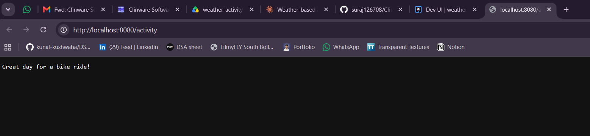
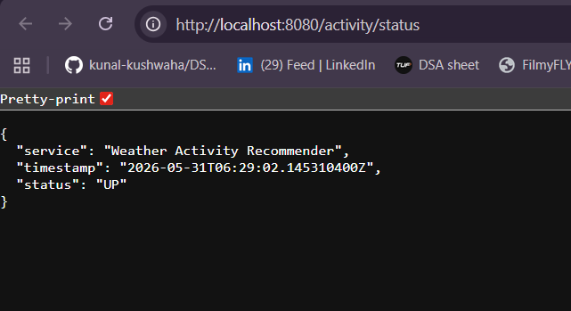
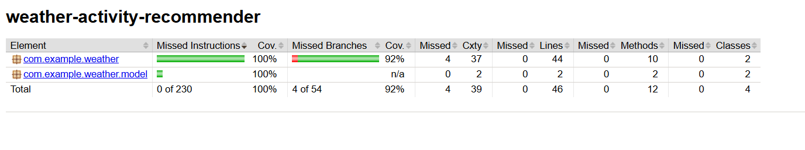

# Weather-Based Activity Recommender

A REST service that fetches current weather data for a given location and recommends an activity based on temperature and weather conditions. Built as an internship assignment using **Java 21**, **Maven**, and **Quarkus**.

## Overview

The application integrates with the [Open-Meteo API](https://open-meteo.com/) to retrieve live weather data and applies rule-based logic to suggest suitable outdoor or indoor activities. It also includes anomaly scoring with bitwise operations and twin-prime detection, plus a health-check endpoint for service monitoring.

## Tech Stack

- Java 21
- Quarkus 3.35.3
- Maven
- MicroProfile REST Client
- JaCoCo (test coverage)

## Features

| Task | Description | Status |
|------|-------------|--------|
| **TASK 1** | REST client to fetch weather from Open-Meteo | Done |
| **TASK 2** | Activity recommendation logic based on temperature & weather code | Done |
| **TASK 3** | Anomaly scoring (XOR + twin-prime reversal) | Done |
| **TASK 4** | External service endpoint configuration | Done |
| **TASK 5** | Health-check status endpoint | Done |

## API Endpoints

| Method | Path | Description |
|--------|------|-------------|
| `GET` | `/activity?lat={latitude}&lon={longitude}` | Returns a plain-text activity recommendation for the given coordinates |
| `GET` | `/activity/status` | Returns a JSON health-check response |

### Example Requests

```bash
# Get activity recommendation (defaults to current weather at given coordinates)
curl "http://localhost:8080/activity?lat=48.85&lon=2.35"

# Health check
curl "http://localhost:8080/activity/status"
```

## How to Run

### Prerequisites

- Java 21+
- Maven (or use the included Maven wrapper)

### Development Mode

```bash
./mvnw quarkus:dev
```

The application starts at `http://localhost:8080`.

### Run Tests

```bash
./mvnw test
```

All **19 tests** pass (17 service tests + 2 resource tests).

### Test Coverage

After running tests, open the JaCoCo report:

```
target/jacoco-report/index.html
```

**Coverage summary:**

| Metric | Coverage |
|--------|----------|
| Instructions | 100% |
| Branches | 92% |
| Lines | 100% |
| Methods | 100% |
| Classes | 100% |

## Output Screenshots

### Activity Recommendation

`GET /activity` returns a weather-based activity suggestion:



### Health Check

`GET /activity/status` returns service status as JSON:



### JaCoCo Coverage Report

Test coverage report generated after running `mvn test`:



## Project Structure

```
src/main/java/com/example/weather/
├── ActivityResource.java          # REST endpoints
├── ActivityService.java           # Recommendation & anomaly logic
├── client/
│   ├── WeatherServiceClient.java  # Open-Meteo REST client
│   └── McpServiceClient.java      # MCP personalization client
└── model/
    └── WeatherResponse.java       # Weather API response model
```

## Configuration

External service URLs are configured in `src/main/resources/application.properties`:

- **Open-Meteo:** `https://api.open-meteo.com`
- **MCP API (echo simulator):** `https://postman-echo.com`

## Anomaly Scoring Logic

The anomaly scoring applies two special rules to recommendations:

1. **Bitwise XOR:** If the `weatherCode` is odd, the rounded base score is XORed with `0x0F`.
2. **Twin Prime Reversal:** If the final score is a twin prime (a prime where `p-2` or `p+2` is also prime), the recommendation string is reversed character-wise.

---

Built for the Weather-Based Activity Recommender internship assignment.
